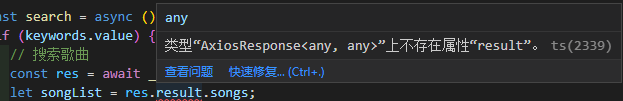
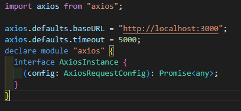

## Vue3+TS问题及解决

### 1.响应数据中的对象不存在



```javascript
&报错原因
	AxiosResponse上并没有自己规定返回的一些字段
&解决方法
	1.在axios二次封装中规定返回字段
        declare module 'axios' {
          interface AxiosInstance {
            (config: AxiosRequestConfig): Promise<any>
          }
        }
```




### 2.操作DOM节点的style属性，DOM节点可能为null


```javascript
&报错原因
	vue3通过ref获取的元素ts推断类型为null
&解决方法
	使用类型断言为any
```


### 3.v-for指令渲染节点，item为never


```javascript
&报错原因
	ts推断数组类型为never[]
&解决方法
	断言数组类型为any
```

### 4.v-for循环props的数组，item为unknown


```javascript
&报错原因
	ts推断数组类型为never[]
&解决办法
	声明接口类型
    	interface songsProps {
          alName: string;
          arName: string;
          dt: number;
          fee: number;
          id: number;
          name: string;
        }
```


### 5.el-carousel接口请求的图片不第一轮第一页不显示


```javascript
&问题原因
	vue3setup相当于vue2生命周期beforeCreate和created，在渲染节点的时候数据还没加载完成
&解决办法
	1.获取el-carousel
	2.在onMounted生命周期中使用超时计时器设置carousel.value.setActiveItem(0)
```


